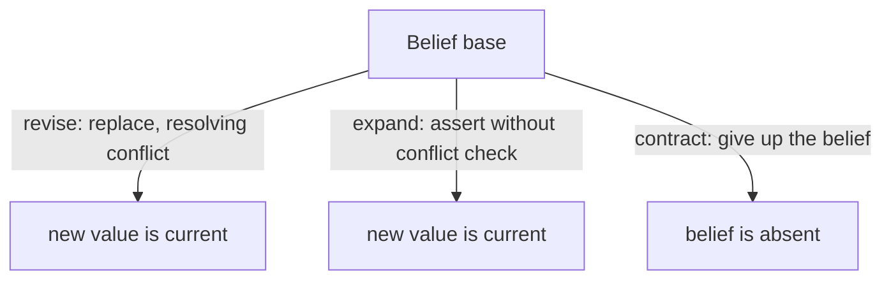

# What Is AGM Belief Revision? Revise, Expand, Contract

doxastica is, at its heart, an implementation of *AGM belief revision*. If you arrived here fluent in Python, pydantic, and graph databases but new to belief-revision theory, this page is for you. It explains the problem AGM solves, the three operations doxastica exposes, and the specific design choices doxastica makes within the theory.

## The epistemic problem

Imagine a system that holds knowledge about the world and must update that knowledge as new information arrives. This is harder than it sounds. New information sometimes confirms what you already hold, sometimes adds to it, and sometimes *contradicts* it. When it contradicts, you cannot simply jam the new fact in alongside the old: you would hold both "the satellite is nominal" and "the satellite is degraded" at once, which is incoherent.

AGM (named for Alchourrón, Gärdenfors, and Makinson, who formalized it in 1985) is the standard theory for *how a rational agent should change its beliefs*. It does not tell you *what* to believe; it tells you what properties a *change* of belief should have, so that the result is principled rather than ad hoc.

The naive alternative is "just overwrite the row." That loses history, loses provenance, and gives you no guarantees about consistency. AGM is the disciplined version.

## Belief base vs belief set

Two terms recur in the theory, and the distinction matters for understanding doxastica:

- A **belief set** is the full *logical closure* of what an agent believes: every fact plus everything those facts entail. If you believe "all satellites have batteries" and "this is a satellite," the belief *set* also contains "this has a battery," even if you never wrote that down.
- A **belief base** is the finite set of facts you *explicitly* hold: the things actually recorded, without computing their consequences.

doxastica works with **belief bases**, not belief sets. It stores the ground facts you record and does not run an inference engine to compute entailments. This is a deliberate choice: doxastica's [`BeliefState`](../reference/doxastica/models.md#doxastica.models.BeliefState) records carry an opaque `value` the core never interprets. What that value *means*, and what it might entail, belongs to the application layer above doxastica, never to the core.

When you call [`query_scope`](../reference/doxastica/core.md#doxastica.core.MemoryCore.query_scope), you get back the current belief base of a scope: the facts explicitly held right now, one current state per belief.

## The three operations

AGM defines three ways to change a belief base. doxastica exposes all three.

### Revision

*Revision* incorporates new information, resolving any conflict in favour of the new fact. You revise "satellite is nominal" to "satellite is degraded" and the base now holds the new value, with the old one no longer current. In doxastica this is [`revise`](../reference/doxastica/core.md#doxastica.core.MemoryCore.revise).

### Expansion

*Expansion* adds new information *without* worrying about consistency: you simply assert a fact. In classical AGM, revision and expansion differ precisely in whether contradictions are resolved. doxastica exposes [`expand`](../reference/doxastica/core.md#doxastica.core.MemoryCore.expand) for this.

### Contraction

*Contraction* gives up a belief: you stop holding a fact without asserting its negation. After contracting "satellite is nominal," the base simply does not hold any value for satellite status. In doxastica this is [`contract`](../reference/doxastica/core.md#doxastica.core.MemoryCore.contract).

## What doxastica keeps, and what it drops

doxastica is a *faithful but opinionated* implementation. Two choices are worth understanding up front.

### Revise and expand are mechanically identical here

In full AGM, revision differs from expansion by enforcing consistency. But consistency enforcement requires interpreting belief *values* (deciding whether two facts contradict), and doxastica's core deliberately never inspects values. They are opaque. As a result, at the core, `revise` and `expand` do exactly the same thing: append a new active state.

This is not a shortcut; it is a boundary. Value-level consistency reasoning belongs to the application that knows what the values *mean*. doxastica gives you both operation names (so consumers expecting either family find it) backed by the same append. If you want value semantics, you build them above doxastica.

### No recovery: the superseded chain instead

Classical AGM includes a *recovery* postulate: if you contract a belief and then add it back, you should recover everything you had before. Recovery is one of the more contested parts of AGM, and honouring it requires the ability to *undo*, to restore prior state.

doxastica drops recovery deliberately. Instead it is **append-only**: every change appends a new state, and nothing is ever deleted or rewritten. A contraction appends a `retracted` state; it does not remove the active one. This gives you a complete, immutable audit trail: the full history is always queryable with [`get_revision_chain`](../reference/doxastica/core.md#doxastica.core.MemoryCore.get_revision_chain). The trade-off, and why it is a good one, is the subject of [The Superseded Chain: Append-Only, No Recovery](superseded-chain-no-recovery.md).

## Postulates and why mechanical verification matters

AGM's value comes from its *postulates*: formal properties each operation must satisfy. For example, *vacuity* says contracting a belief you do not hold should change nothing; *success* says after revising with a fact, that fact is in the base. These are precise mathematical conditions, not informal guidelines.

doxastica's defining promise is that these properties are **mechanically verified**, not merely asserted in prose. The vacuity property you can observe directly (contracting an absent belief in doxastica is a genuine no-op, as shown in [How to Retract a Belief with contract](../how-to/contract-a-belief.md)) is backed by property tests that check the postulates hold across many generated operation sequences. When correctness is the whole point of a library, "we tested some examples" is not enough; the postulates are checked as properties.

That is what makes doxastica usable as a *reference* implementation: you can trust its correctness without auditing the internals yourself.

## Key takeaways

- AGM is the standard theory for principled belief change; doxastica implements it over **belief bases** (explicit facts), not belief sets (logical closures).
- The three operations are **revise**, **expand**, and **contract**: exposed as `revise`, `expand`, and `contract`.
- doxastica makes two deliberate choices: `revise` and `expand` are identical at the core (no value-level consistency engine), and it drops AGM *recovery* in favour of an append-only superseded chain.
- The postulates are verified mechanically, which is what lets doxastica serve as a trustworthy reference implementation.

## Further reading

- [The Kumiho Architecture](kumiho-architecture.md): the graph-native design doxastica implements.
- [The Superseded Chain: Append-Only, No Recovery](superseded-chain-no-recovery.md): why nothing is ever deleted.
- [Your First Belief Store](../tutorials/first-belief-store.md): see the three operations in action.
