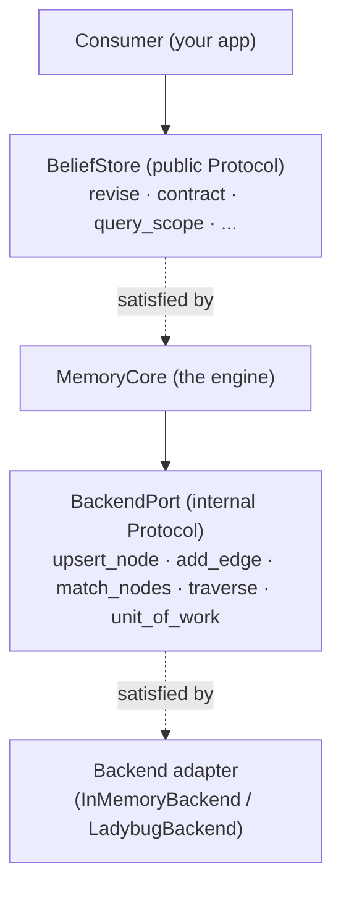

# The Two Seams: BeliefStore vs BackendPort

doxastica has two distinct `typing.Protocol` seams, and keeping them straight clears up most questions about how the library is structured. One faces *consumers* of belief revision; the other faces *storage backends*. This page explains what each is, why there are two, and which one you actually touch.

## The public seam: BeliefStore

[`BeliefStore`](../reference/doxastica/protocol.md#doxastica.protocol.BeliefStore) is the public contract, the structural `Protocol` that consumers code against. It describes the belief-revision surface in domain terms: `revise`, `expand`, `contract`, `query_scope`, `get_impact`, `get_revision_chain`, `get_scope_at`, `add_edge`, and `get_or_create_scope`.

This is the seam your application depends on. [`MemoryCore`](../reference/doxastica/core.md#doxastica.core.MemoryCore) satisfies it, so you can type your code against `BeliefStore` and remain free to swap the concrete engine. Because it is a *structural* protocol, an implementer does not inherit from it; satisfying the method signatures is enough.

Two properties are deliberately baked into the public signatures:

- `query_scope` takes a **closed** [`BeliefFilter`](../reference/doxastica/models.md#doxastica.models.BeliefFilter), never a free-text query string. A free query string would be the prime injection and structure-leak risk; the typed filter makes that unrepresentable at the seam.
- `get_impact` returns an [`ImpactResult`](../reference/doxastica/models.md#doxastica.models.ImpactResult) carrying `frontier` and `truncated`, so a bounded cascade can never silently under-report.

These are not implementation details; they are promises encoded in the contract itself.

## The internal seam: BackendPort

[`BackendPort`](../reference/doxastica/ports.md#doxastica.ports.BackendPort) is the *second* protocol, sitting **below** `BeliefStore`. Where `BeliefStore` speaks in belief-revision operations, `BackendPort` speaks in generic graph primitives: `upsert_node`, `add_edge`, `match_nodes`, a single generic `traverse`, and `unit_of_work`. That is the entire port: five primitives.

A storage adapter (the LadybugDB reference backend, or the zero-dependency in-memory backend) implements `BackendPort`. The core composes belief-revision operations *out of* these five primitives. Critically, the port exposes **no** method that takes a query or Cypher string. There is no `run`, no `query`, no `execute`. This is a decision, not an omission: a query-string passthrough would re-open the injection surface the public seam designed out, and it would couple the supposedly backend-agnostic core to one storage dialect.

## Why two seams

It would be simpler to have one protocol. doxastica has two because the two boundaries serve genuinely different audiences and protect genuinely different things.

The public seam protects **domain integrity**: it ensures consumers interact with beliefs only through typed, AGM-shaped operations, with no way to smuggle storage concepts or query strings across. The internal seam protects **backend agnosticism**: it ensures the core can run on any graph store that offers five primitives, without the core ever knowing which one, and without any storage dialect leaking upward.

Collapsing them into one protocol would force a choice you do not want to make: either the public surface gains low-level graph primitives (exposing storage to consumers), or the storage adapters must implement high-level AGM operations (duplicating the engine's logic in every backend). Two seams keep each concern where it belongs: the engine's logic lives once, in the core, between the two contracts.

## What each audience touches

The division of labour is clean:

| You are... | You touch... | You implement... |
|------------|--------------|------------------|
| An integrator using doxastica | `BeliefStore` / `MemoryCore` | nothing; you construct and call |
| A backend author | `BackendPort` | the five graph primitives |

If you are integrating doxastica into a larger system (the overwhelmingly common case), you live entirely on the public side. You build a `MemoryCore`, inject a backend, and call belief-revision methods. You never see or implement `BackendPort`; it is below your floor.

You reach for `BackendPort` only if you are writing a *new storage backend*, adapting doxastica to a graph store it does not yet support. That is a deliberate, advanced task with its own contract document, and it is the only reason to implement the five primitives yourself.

!!! info "The two protocols are provably distinct"
    The separation is enforced, not merely conventional. The two seams are deliberately distinct objects, and that distinctness is checked mechanically rather than left to discipline. The public seam never imports a storage driver, and the internal seam never speaks a storage dialect: each boundary is verified, not merely intended.

## Driver-blind core, pluggable backends

The payoff of the two-seam design is twofold.

The core is **driver-blind**: `MemoryCore` imports no storage driver and names no backend. Importing the core never drags in an optional dependency like LadybugDB. This is why the base `pip install doxastica` ships a working in-memory engine with zero extra dependencies: the core simply does not know LadybugDB exists. (Construction is pure dependency injection precisely because of this: the caller builds the backend and injects it, so the core never has to name one. See [How to Use the LadybugDB Backend](../how-to/ladybug-backend.md).)

Backends are **pluggable**: any object satisfying the five `BackendPort` primitives can power the engine. The in-memory backend doubles as a correctness oracle, and the LadybugDB backend adds durability. A future backend is just another adapter behind the same port, added as an optional extra and never as a new required dependency.

## Key takeaways

- **`BeliefStore`** is the public, domain-level Protocol consumers code against; `MemoryCore` satisfies it.
- **`BackendPort`** is the internal, graph-primitive Protocol storage adapters implement: five primitives, no query-string method.
- Two seams exist to protect **domain integrity** above and **backend agnosticism** below, keeping the engine's logic in one place.
- Integrators touch only the public seam; backend authors touch only the internal one.
- The result is a **driver-blind core** with **pluggable backends**, plus a zero-dependency default install.

## Further reading

- [The Kumiho Architecture](kumiho-architecture.md): the domain-agnostic boundary the seams enforce.
- [How to Use the LadybugDB Backend](../how-to/ladybug-backend.md): injecting a concrete backend.
- [How to Lease a Shared LadybugDB Connection](../how-to/lease-shared-connection.md): backend ownership in tenant mode.
