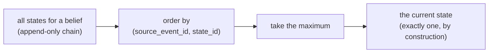

# Derived Current State and the UUID7 Ordering Contract

doxastica never stores a "current state" pointer. The current value of every belief is *computed* on demand from the append-only chain. This page explains why that design is safer than a stored pointer, how the ordering that makes it work is defined, and why UUID7 is the right key for it.

## Current is a theorem, not a stored pointer

In a typical mutable store, "current" is a pointer: a column, a flag, or a `CURRENT_STATE` edge that says *this row is the live one*. Whenever you update, you must also move the pointer. The trouble is that a pointer can drift. Move it and forget to clear the old one, and you have two "current" rows. Crash between the write and the pointer move, and you have a state with no current marker at all. The pointer is a second source of truth that can disagree with the data.

doxastica eliminates the pointer entirely. There is no `CURRENT_STATE` edge and no current flag. Instead, the current state of a belief is *derived*: doxastica takes all the states for that belief and selects the latest one by a fixed ordering. The uniqueness you observe (exactly one current state per belief) is not enforced by a constraint that could be violated; it is a **mathematical consequence** of taking the maximum of a totally ordered set. There is always exactly one maximum.

This is what "current is a theorem, not a stored pointer" means. You do not maintain currency; you compute it, and the computation cannot produce a duplicate or a gap.

## The ordering contract: (source_event_id, state_id)

For "take the latest" to be well-defined, the states need a *total, deterministic* order. doxastica defines exactly one ordering contract, used everywhere: the current-state selection, [`get_revision_chain`](../reference/doxastica/core.md#doxastica.core.MemoryCore.get_revision_chain), and [`get_scope_at`](../reference/doxastica/core.md#doxastica.core.MemoryCore.get_scope_at) all honour the same order, so they can never disagree.

The order is a pair:

1. **Primary: `source_event_id`.** This is the UUID7 *you* supply on every write, your handle for the event that caused the change. UUID7 is time-ordered by construction (RFC 9562 §5.7), so comparing two `source_event_id`s in byte order compares them in time order.
2. **Tiebreak: `state_id`.** This is the UUID7 the *core* mints for each state. When two states share a `source_event_id`, the core-minted `state_id` breaks the tie.

A state on top of the chain (the one with the greatest `(source_event_id, state_id)` pair) is the current one. Each [`BeliefState`](../reference/doxastica/models.md#doxastica.models.BeliefState) carries both ids as fields, so the ordering is computed from data the state already holds.

## UUID7 and intra-millisecond collisions

Why does the tiebreak exist at all? Because doxastica does not demand that *you* keep your `source_event_id`s strictly increasing within a millisecond.

UUID7 encodes a timestamp, so values minted in sequence are generally time-ordered. But two events can land in the same millisecond. doxastica does **not** require callers to guarantee intra-millisecond monotonicity of `source_event_id`; that would be an awkward burden to push onto every consumer. So it is entirely possible for two states to carry the *same* `source_event_id`, or two that are indistinguishable at millisecond resolution.

That is exactly what the `state_id` tiebreak handles. The core mints `state_id` **write-monotonically**: each new state gets a `state_id` that sorts after the previous one. So even when caller `source_event_id`s collide, the tiebreak reflects *true insertion order*: the state written later wins. The pair `(source_event_id, state_id)` is therefore a total order even under caller collisions, and "the latest state" is always unambiguous.

## How current is computed

Putting it together, here is what happens when you read the current base with [`query_scope`](../reference/doxastica/core.md#doxastica.core.MemoryCore.query_scope):

1. Gather all states in the scope.
2. Group them by belief.
3. For each belief, take the maximum by `(source_event_id, state_id)`, its current tail. This is done over *all* statuses first.
4. Apply the retracted rule: if that maximum is a `retracted` state, the belief has no active current and is absent from the base.

Step 3 happening *before* the status check is deliberate and important. If doxastica filtered to active states first and *then* took the maximum, a retracted tail sitting on top of an older active state would be skipped, and the stale active value would wrongly resurface. Taking the maximum status-agnostically, then checking whether that winner is retracted, is what makes a contraction correctly clear a belief. The same maximum-then-check logic, applied over a cut window instead of "now," is how [`get_scope_at`](../reference/doxastica/core.md#doxastica.core.MemoryCore.get_scope_at) reconstructs the past.

## Why there is no CURRENT_STATE edge

The omission surprises people who expect a graph database to mark the live node, so it is worth stating plainly. doxastica's storage schema has node tables and the structural revision edges, but **no `CURRENT_STATE` table or edge**. There is deliberately nothing to point at "the current one."

This is the storage-level expression of "current is a theorem." A `CURRENT_STATE` edge would be the very pointer that can drift, the second source of truth doxastica refuses to keep. By computing current from the immutable, totally-ordered chain instead, doxastica guarantees the answer is always consistent with the data, because it *is* the data. There is no separate marker to maintain, corrupt, or reconcile.

This rests on the append-only spine described in [The Superseded Chain: Append-Only, No Recovery](superseded-chain-no-recovery.md): because states are immutable and the chain only grows, the maximum is stable and the derivation is sound.

## Key takeaways

- doxastica **derives** current state by taking the maximum of a totally-ordered chain; uniqueness is a mathematical consequence, not an enforced constraint.
- The order is the pair **`(source_event_id, state_id)`**: your supplied event id primary, the core-minted state id as tiebreak. The same order is used across current selection, history, and time-travel.
- The tiebreak exists because callers are **not** required to keep `source_event_id` monotonic within a millisecond; the write-monotonic `state_id` recovers true insertion order.
- There is **no `CURRENT_STATE` edge**: the pointer that could drift is simply not kept.

## Further reading

- [The Superseded Chain: Append-Only, No Recovery](superseded-chain-no-recovery.md): the immutable spine this derivation rests on.
- [How to Reconstruct a Scope's State at a Point in Time](../how-to/reconstruct-scope-at.md): the same ordering applied to the past.
- [How to Query the Current Belief Base with BeliefFilter](../how-to/query-with-belief-filter.md): reading the derived current base.
