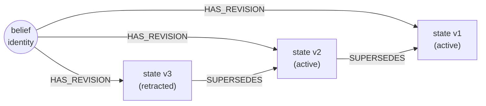

# The Kumiho Architecture

doxastica is a faithful, independently buildable implementation of the **Kumiho** architecture ([arXiv 2603.17244](https://arxiv.org/abs/2603.17244)), with two deliberate, documented departures. If you found doxastica through the Kumiho paper, or you want to understand the design lineage behind the API, this page maps the architecture to the code.

## What Kumiho is

Kumiho is a *graph-native* approach to belief revision. Rather than treating beliefs as rows in a table or entries in a logic database, Kumiho models them as a graph: belief states are nodes, and the relationships between them (supersession, dependency, derivation) are edges. The structure of belief change becomes the structure of the graph.

This matters because belief revision is fundamentally about *relationships over time*: which state replaced which, which belief was derived from which other belief, what a change cascades into. A graph expresses those relationships directly, so questions like "what does this affect?" become graph traversals rather than bespoke bookkeeping.

doxastica takes this architecture seriously enough to be buildable on its own: you do not need the paper, the original system, or any larger project to use it.

## Graph-native ground triples

Kumiho stores *ground facts* (concrete, explicit beliefs), not inferred conclusions. doxastica follows this exactly. A belief state is a finite, explicit value object: the [`BeliefState`](../reference/doxastica/models.md#doxastica.models.BeliefState) model carries a closed set of fields and an opaque `value` the core never interprets.

There is no deductive closure, no inference engine, no rule firing inside doxastica. The core records what you tell it and computes structural answers (current state, history, impact) from the graph, never semantic ones. What a belief *means* is the application's concern, kept on the opaque value or on labels the application owns above the core. This is the boundary that keeps doxastica domain-agnostic.

## The append-only spine

The backbone of the architecture is an **append-only revision spine**. Every change appends a new belief state; nothing is ever deleted or rewritten. Each belief has a logical identity, and its states hang off that identity through structural `HAS_REVISION` edges, with `SUPERSEDES` edges chaining each new state to the one it replaced.

Because the spine is append-only, the full history is always present and the *current* state is something doxastica *derives* by ordering the states; it is never a mutable pointer that could drift. The mechanics of that derivation are covered in [Derived Current State and the UUID7 Ordering Contract](derived-current-uuid7-ordering.md), and the audit payoff in [The Superseded Chain](superseded-chain-no-recovery.md).

## doxastica's two deliberate departures

doxastica is faithful to Kumiho but makes two conscious changes, each chosen rather than accidental.

### Multi-scope (an extension)

Kumiho as described is **single-agent**: one belief-holder. doxastica extends this to **multi-scope**: a belief base can be partitioned into named scopes, each an independent belief-holder, with one reserved *world scope* for shared, privileged knowledge. This is an *addition* to the architecture, not a reinterpretation of it; single-scope usage is just the special case of using one scope. The full model is described in [Scopes and the World Scope](scopes-and-world-scope.md).

### No recovery (an exclusion)

Classical AGM, which Kumiho builds on, includes a *recovery* postulate that requires the ability to undo a contraction. doxastica deliberately **excludes recovery**, replacing it with superseded-chain semantics: a contraction appends a `retracted` state instead of removing anything, so there is nothing to "recover" because nothing was lost. This trades a contested theoretical property for a complete, immutable audit trail. See [The Superseded Chain: Append-Only, No Recovery](superseded-chain-no-recovery.md) for the full argument.

## The domain-agnostic boundary

doxastica's most important architectural rule is what it *refuses* to contain. It is a pure belief-revision core with **no application-domain concepts inside it**. The core stores opaque values and generic, domain-agnostic edge types (exactly `SUPERSEDES`, `DEPENDS_ON`, and `DERIVED_FROM`, the members of [`EdgeType`](../reference/doxastica/models.md#doxastica.models.EdgeType)), and nothing that names a specific application domain.

This is not minimalism for its own sake. It is what makes doxastica reusable and verifiable: every domain concept that *could* leak in is, by construction, kept out, so the formal core stays faithful to the paper's domain-agnostic model. The two seams that enforce this boundary, one facing consumers and one facing storage backends, are explained in [The Two Seams: BeliefStore vs BackendPort](beliefstore-vs-backendport.md).

## Key takeaways

- Kumiho is a graph-native belief-revision architecture; doxastica implements it as a standalone, independently buildable library.
- It stores explicit ground facts on an **append-only spine**, deriving current state and history from graph structure rather than mutating in place.
- doxastica makes two deliberate changes: it **adds** multi-scope and **drops** AGM recovery.
- The whole design defends a **domain-agnostic boundary** (no application concepts inside the core), which is what makes it a reusable, verifiable reference implementation.

## Further reading

- [What Is AGM Belief Revision?](agm-belief-revision.md): the theory Kumiho builds on.
- [Scopes and the World Scope](scopes-and-world-scope.md): the multi-scope extension.
- [The Superseded Chain: Append-Only, No Recovery](superseded-chain-no-recovery.md): the no-recovery exclusion.
- [The Two Seams: BeliefStore vs BackendPort](beliefstore-vs-backendport.md): how the boundary is enforced.
