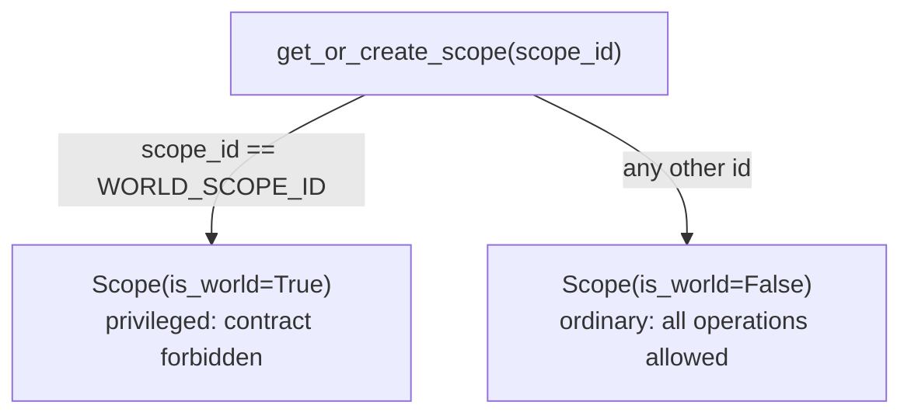

# Scopes and the World Scope

A *scope* is doxastica's unit of belief ownership. This page explains what scopes are, why doxastica has more than one (the original Kumiho architecture has exactly one), and why one particular scope, the *world scope*, is privileged in a way that forbids contraction.

## What a scope is

A scope is a named belief-holder. Every belief lives in exactly one scope, identified by a `scope_id` string. Within a scope, each belief has its own revision history, its own current value, and its own retraction state. Two scopes are completely independent: revising a belief in `agent-a` has no effect on a same-named belief in `agent-b`.

You can think of a scope as a separate "mind." Each scope holds its own coherent picture of the world, and doxastica keeps those pictures from interfering with one another. The [`Scope`](../reference/doxastica/models.md#doxastica.models.Scope) model is a thin record (a `scope_id` and an `is_world` flag) because the interesting behaviour is in how the core *routes* operations by scope, not in the scope object itself.

Scopes come into existence on demand. There is no separate "register a scope" step you must remember; writing a belief into a scope creates it if it does not yet exist. You can also create one explicitly with [`get_or_create_scope`](../reference/doxastica/core.md#doxastica.core.MemoryCore.get_or_create_scope), which we return to below.

## Multi-scope as a Kumiho extension

The Kumiho architecture doxastica implements is described as **single-agent**: one belief-holder, one belief base. doxastica deliberately *extends* this to **multi-scope**.

Why add scopes? Because the systems that consume doxastica rarely model a single mind. A larger application may need to track what each of several agents believes, separate tentative working knowledge from established facts, or keep different subsystems' beliefs apart. Forcing all of that into one undifferentiated base would either lose the distinctions or push the partitioning logic up into every consumer.

Crucially, multi-scope is a *superset*, not a different model. If you use exactly one scope, doxastica behaves precisely as a faithful single-agent Kumiho implementation. The extension costs nothing when you do not need it, and it is there when you do. This is one of doxastica's two deliberate departures from the paper, covered alongside the other in [The Kumiho Architecture](kumiho-architecture.md).

## The reserved world scope

One scope id is reserved: [`WORLD_SCOPE_ID`](../reference/doxastica/models.md#doxastica.models), which has the literal value `"__world__"`. The world scope represents shared, privileged knowledge: facts that are not the private belief of any one agent but hold "for the world."

The id is deliberately dunder-wrapped (`__world__`) rather than a bare word like `"world"`, so it cannot accidentally collide with a scope a consumer genuinely wants to name "world." When you create a scope whose id equals `WORLD_SCOPE_ID`, doxastica derives `is_world=True` on the returned `Scope`; every other id yields an ordinary scope.

For a worked application of shared world facts across many private scopes, see [Build a Shared-World Memory for an Agent Team](../tutorials/agent-team-memory.md).

## Why world-scope contraction is forbidden

You can [`revise`](../reference/doxastica/core.md#doxastica.core.MemoryCore.revise) and [`expand`](../reference/doxastica/core.md#doxastica.core.MemoryCore.expand) in the world scope freely. But [`contract`](../reference/doxastica/core.md#doxastica.core.MemoryCore.contract) on the world scope is **forbidden**: it raises [`WorldScopeContractionError`](../reference/doxastica/errors.md#doxastica.errors.WorldScopeContractionError).

The reasoning is epistemic. Contraction means *giving up* a belief: ceasing to hold a fact without asserting anything in its place. For a private agent scope, that is sensible: an agent can become uncertain. But the world scope models facts that *hold for the world*. "Giving up" a world fact, leaving a hole where shared knowledge used to be, is not a coherent operation in this model. If a world fact changes, you `revise` it to a new value (superseding the old one); you do not retract it into a void.

Forbidding the operation outright, rather than silently doing something surprising, keeps the model honest. The guard is also strict about *when* it fires: it is the very first thing `contract` checks, before any storage access, so a forbidden world-scope contraction can never leak a partial write even if the world scope was never created. The practical handling, including how to catch the error and what to do instead, is in [How to Retract a Belief with contract](../how-to/contract-a-belief.md).

!!! info "Reads on the world scope are unrestricted"
    The restriction is only on contraction. You can [`query_scope`](../reference/doxastica/core.md#doxastica.core.MemoryCore.query_scope), [`get_scope_at`](../reference/doxastica/core.md#doxastica.core.MemoryCore.get_scope_at), and [`get_revision_chain`](../reference/doxastica/core.md#doxastica.core.MemoryCore.get_revision_chain) against the world scope exactly like any other scope. Reconstructing world history at a point in time is a perfectly valid read.

## get_or_create_scope semantics

[`get_or_create_scope`](../reference/doxastica/core.md#doxastica.core.MemoryCore.get_or_create_scope) is the explicit way to ensure a scope exists. Its behaviour is worth understanding precisely:

- It is **idempotent**: calling it twice with the same id returns an equal `Scope` and never creates a duplicate.
- It **derives** `is_world` from the id (`scope_id == WORLD_SCOPE_ID`) rather than taking it as a parameter. You cannot ask for a non-world scope named `__world__`, nor make an ordinary id privileged; the id determines the privilege.
- It does not flip an existing scope's privilege, because privilege is a pure function of the id.

You rarely need to call it directly: the write operations create scopes on demand. Reach for it when you want a scope to exist before you have anything to write into it, or when you want to confirm a scope's `is_world` status.

## Key takeaways

- A **scope** is an independent named belief-holder; beliefs in different scopes never interfere.
- **Multi-scope** is doxastica's deliberate extension of single-agent Kumiho; using one scope recovers the original model exactly.
- The **world scope** (`WORLD_SCOPE_ID == "__world__"`) is reserved for shared, privileged knowledge.
- **Contraction is forbidden** on the world scope (you revise world facts, you do not retract them), and the guard fires before any write.
- `get_or_create_scope` is idempotent and derives `is_world` from the id.

## Further reading

- [Build a Shared-World Memory for an Agent Team](../tutorials/agent-team-memory.md): a worked multi-scope use case built on the world scope.
- [The Kumiho Architecture](kumiho-architecture.md): multi-scope as one of two departures from the paper.
- [How to Retract a Belief with contract](../how-to/contract-a-belief.md): handling the world-scope guard in practice.
- [What Is AGM Belief Revision?](agm-belief-revision.md): what contraction means epistemically.
