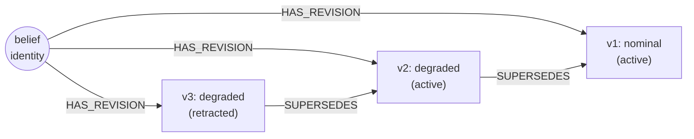

# The Superseded Chain: Append-Only, No Recovery

doxastica never deletes or rewrites a belief state. Every change appends. This page explains the structure that makes that work, the superseded chain, and why doxastica trades the classical AGM *recovery* postulate for a complete, immutable audit history.

## Append-only revision spine

The single most important invariant in doxastica is this: **no operation removes or rewrites a belief state, and revision is forward-only.** A revise appends. An expand appends. A contract appends. Nothing is ever mutated in place, and nothing is ever deleted.

This is a strong promise, and it is what everything else rests on. Because states are immutable once written, you can hold a reference to a [`BeliefState`](../reference/doxastica/models.md#doxastica.models.BeliefState) and trust it will never change underneath you. Because the spine only grows, the history is always complete. And because nothing is ever overwritten, there is no "lost update": concurrent or sequential, every recorded change is preserved.

## The SUPERSEDES and HAS_REVISION structure

Two structural edge types build the spine. They are *internal* structural wiring, distinct from the consumer-facing [`EdgeType`](../reference/doxastica/models.md#doxastica.models.EdgeType) members you lay yourself, and the core manages them automatically on every write.

- **`HAS_REVISION`** connects a belief's stable logical identity to each of its states. Every state a belief has ever had hangs off the same identity hub through a `HAS_REVISION` edge. This is what makes "give me the whole history of belief X" a structural lookup.
- **`SUPERSEDES`** chains each new state to the one it replaced. When you revise a belief, the new state gets a `SUPERSEDES` edge pointing at the prior current state, recording the order of replacement directly in the graph.

A contraction fits the same pattern: it appends a new `retracted` state that supersedes the prior current one, carrying the prior value forward verbatim. The active state below it is untouched; it is simply no longer the tail.

## Why nothing is ever deleted

The temptation, when a belief changes, is to overwrite. It seems simpler: one row, always current. doxastica refuses this for concrete reasons.

**Provenance survives.** Downstream reasoning often depends on *how* a belief came to hold its value. Overwriting destroys that. With the superseded chain, the path from the first value to the current one is always there to inspect.

**Auditing is possible.** A system you cannot audit is a system you cannot debug or trust. When something goes wrong, "what did this scope believe, and when did it change?" must be answerable. Append-only makes it answerable by construction. See [`get_revision_chain`](../reference/doxastica/core.md#doxastica.core.MemoryCore.get_revision_chain) for the full ordered history and [`get_scope_at`](../reference/doxastica/core.md#doxastica.core.MemoryCore.get_scope_at) for point-in-time reconstruction.

**The current state stays trustworthy.** Because the spine is append-only and totally ordered, the *current* value is computed by taking the latest state; it is never a stored pointer that could be left dangling or pointed at the wrong row. The mechanics are covered in [Derived Current State and the UUID7 Ordering Contract](derived-current-uuid7-ordering.md), but the foundation is the immutable chain described here.

## How superseded chains replace AGM recovery

Classical AGM includes a *recovery* postulate: contract a belief, then add it back, and you should recover everything you previously held. Recovery is among the most debated parts of AGM precisely because honouring it implies an ability to *undo*, to restore prior state, with all the complications that brings.

doxastica sidesteps the debate. It **excludes recovery** and offers superseded-chain semantics instead. The reasoning is almost tautological once you see it: *you cannot lose what you never delete.* A contraction does not remove the prior states; it appends a `retracted` tail on top of them. The earlier active state, with its value, is still right there on the chain. There is nothing to "recover" because nothing was lost in the first place.

This is a genuine trade-off, made deliberately. You give up the formal recovery postulate (and the rewind-capable machinery it would require). In exchange you get a model that is simpler to reason about, impossible to corrupt by a botched undo, and that hands you a complete audit trail for free. For a library whose entire value proposition is provable correctness, the immutable, append-only choice is the one that keeps the guarantees tractable.

!!! warning "Append-only means contraction is not deletion"
    If you expect [`contract`](../reference/doxastica/core.md#doxastica.core.MemoryCore.contract) to remove data, it will surprise you: the data is still there, and you can see it with `include_retracted=True` on [`query_scope`](../reference/doxastica/core.md#doxastica.core.MemoryCore.query_scope) or via [`get_revision_chain`](../reference/doxastica/core.md#doxastica.core.MemoryCore.get_revision_chain). This is intentional. doxastica retracts beliefs; it never erases them. See [How to Retract a Belief with contract](../how-to/contract-a-belief.md).

## The audit-history payoff

The append-only spine is not a constraint you tolerate; it is the feature. Three capabilities fall directly out of it, with no extra machinery:

1. **Complete history.** [`get_revision_chain`](../reference/doxastica/core.md#doxastica.core.MemoryCore.get_revision_chain) returns every state a belief ever had, in order.
2. **Time-travel.** [`get_scope_at`](../reference/doxastica/core.md#doxastica.core.MemoryCore.get_scope_at) reconstructs any past state from the chain ordering alone, with no snapshots stored or needed.
3. **Impact analysis over real lineage.** Because dependency edges point at the specific states involved, [`get_impact`](../reference/doxastica/core.md#doxastica.core.MemoryCore.get_impact) traces cascades over the actual recorded structure, not a reconstructed guess.

A mutable store gives you none of these without bolting on extra history tracking. An append-only store gives you all of them as a consequence of its shape.

## Key takeaways

- doxastica is **append-only**: revise, expand, and contract all append; nothing is ever deleted or rewritten.
- The spine is built from internal **`HAS_REVISION`** (identity-to-states) and **`SUPERSEDES`** (state-replaces-state) edges, managed automatically.
- doxastica **replaces AGM recovery** with superseded chains: you cannot lose what you never delete.
- The payoff is a complete, immutable **audit history**, with time-travel and impact analysis falling out for free.

## Further reading

- [Derived Current State and the UUID7 Ordering Contract](derived-current-uuid7-ordering.md): how current state is computed over the chain.
- [The Kumiho Architecture](kumiho-architecture.md): no-recovery as a deliberate departure.
- [How to Inspect Revision History with get_revision_chain](../how-to/inspect-revision-history.md): read the chain in practice.
