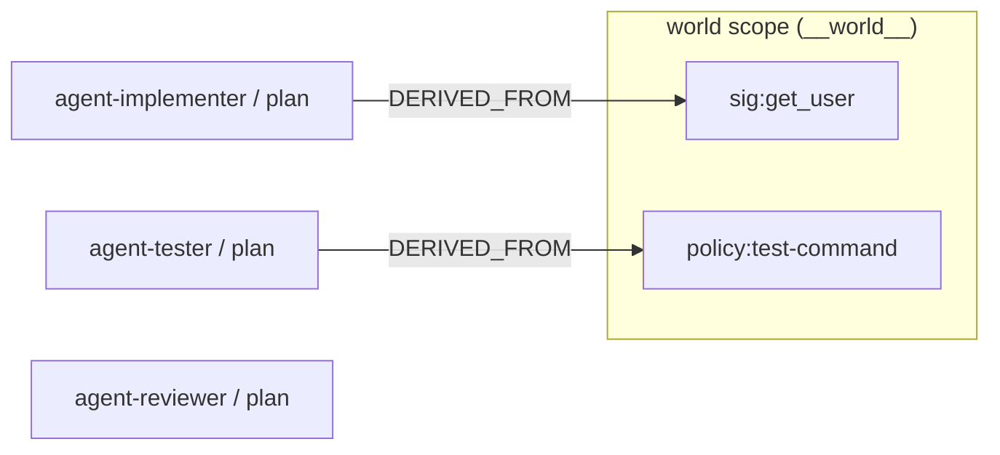

# Build a Shared-World Memory for an Agent Team

Imagine a harness running a team of coding agents. They share one body of truth about
the project: the shape of an API, where a module lives, the command that runs the tests.
Each agent reads from that shared truth and forms its own private plan. When the truth
shifts, because a refactor lands or the user edits `AGENTS.md`, the harness has to answer a
sharp question: *which agents were relying on what just changed, and now need to replan?*

This tutorial builds exactly that memory on top of doxastica. It is where the multi-scope
extension earns its place: the original single-agent Kumiho architecture holds one belief
base, so it cannot even express "which agent?" doxastica gives each agent its own scope and
answers the question for you.

By the end you will have:

- Modeled each agent as a [scope](../explanation/scopes-and-world-scope.md) and the team's shared truth as the reserved **world scope**.
- Recorded *why* an agent believes something with cross-scope [`DERIVED_FROM`](../reference/doxastica/models.md#doxastica.models.EdgeType) edges.
- Used [`get_impact`](../reference/doxastica/core.md#doxastica.core.MemoryCore.get_impact) to find exactly which agents a change to shared truth makes stale, each tagged with its own `scope_id`.
- Reconstructed what an agent believed at plan time for an audit trail.

**Time:** about 20 minutes.

**Prerequisites:** Python 3.14 and the zero-dependency in-memory backend. Nothing to install
beyond `pip install doxastica`. It helps to have met the core operations first in
[Your First Belief Store](first-belief-store.md).

!!! info "doxastica knows nothing about agents"
    There is no "agent", "filesystem", or "AGENTS.md" concept inside the library. You *map*
    those onto its primitives. Your harness scans the real sources and writes the facts into
    the world scope; doxastica just holds them and answers the staleness query. In
    particular there is **no automatic overlay**: reading an agent's scope returns only that
    agent's own beliefs, never the world scope merged in. Shared knowledge is a separate
    partition plus a convention you record with edges. See [Scopes and the World Scope](../explanation/scopes-and-world-scope.md).

## The mapping

| Harness concept | doxastica primitive |
|---|---|
| An agent on the team | a **scope** (`"agent-implementer"`, an opaque id you choose) |
| Shared truth (from the filesystem and `AGENTS.md`) | beliefs in the reserved **world scope** (`WORLD_SCOPE_ID`) |
| "agent concluded X *because of* shared fact Y" | a cross-scope [`DERIVED_FROM`](../reference/doxastica/models.md#doxastica.models.EdgeType) edge, from the agent's belief to the world fact |
| Shared truth changed | [`revise`](../reference/doxastica/core.md#doxastica.core.MemoryCore.revise) the world fact (you never `contract` it) |
| "which agents are now stale?" | [`get_impact`](../reference/doxastica/core.md#doxastica.core.MemoryCore.get_impact) on the *prior* world-fact state |

## Step 1: Build the core

[`MemoryCore`](../reference/doxastica/core.md#doxastica.core.MemoryCore) takes a backend you
inject. We use the zero-dependency [`InMemoryBackend`](../reference/doxastica/backends/memory.md#doxastica.backends.memory.InMemoryBackend).

```python
from uuid import uuid7

from doxastica import (
    BeliefFilter,
    EdgeType,
    InMemoryBackend,
    MemoryCore,
    WORLD_SCOPE_ID,
    WorldScopeContractionError,
)

core = MemoryCore(InMemoryBackend())
```

## Step 2: Seed the world scope

The shared truth lives in the world scope, identified by
[`WORLD_SCOPE_ID`](../reference/doxastica/models.md#doxastica.models) (the literal
`"__world__"`). Your harness produces these facts by scanning the project; here we write two,
one from each source, and capture the returned [`BeliefState`](../reference/doxastica/models.md#doxastica.models.BeliefState)
so we can point at it later.

```python
# From the filesystem: the current signature the harness parsed from the source.
sig = core.revise(WORLD_SCOPE_ID, "sig:get_user", "get_user(id) -> User", source_event_id=uuid7())

# From the user's AGENTS.md: the command the project says to run tests with.
policy = core.revise(WORLD_SCOPE_ID, "policy:test-command", "pytest", source_event_id=uuid7())
```

Every write takes a `source_event_id`: a caller-supplied UUID7 the core treats as an opaque,
time-ordered handle. Mint one with the stdlib `uuid7()`.

## Step 3: Give each agent a scope, a plan, and a reason

Now the team. Each agent is its own scope. Each records a private plan and, crucially, an
edge back to the shared fact it derived that plan from. The edge convention is
**dependent to source**: `add_edge(plan, fact, DERIVED_FROM)` reads as "plan was derived
from fact".

`agent-reviewer` is deliberately different: its plan derives from neither shared fact. It is
the control that proves the staleness query is real and not a broadcast.

```python
# Capture the implementer's planning event so we can audit it later.
impl_event = uuid7()
impl = core.revise("agent-implementer", "plan", "call get_user(42)", source_event_id=impl_event)
test = core.revise("agent-tester", "plan", "run pytest tests/", source_event_id=uuid7())
core.revise("agent-reviewer", "plan", "check commit style", source_event_id=uuid7())

# Record provenance. These edges cross scope boundaries, into the world scope.
core.add_edge(impl.state_id, sig.state_id, EdgeType.DERIVED_FROM)
core.add_edge(test.state_id, policy.state_id, EdgeType.DERIVED_FROM)
# agent-reviewer records no edge into a shared fact.
```

Reading an agent's scope returns only that agent's beliefs. There is no world-scope overlay:

```python
view = core.query_scope("agent-implementer", BeliefFilter())
print({b.belief_id: b.value for b in view})
```

You should see just the implementer's own plan, not the shared signature it derived from:

```text
{'plan': 'call get_user(42)'}
```

The team now looks like this. The arrows point from each agent's plan to the shared world
fact it depends on:



## Step 4: A refactor shifts the filesystem truth

A refactor changes the signature of `get_user`. The harness records the new truth by
*revising* the world fact. The prior state is superseded, not deleted, so we can still ask
what depended on it.

```python
core.revise(
    WORLD_SCOPE_ID,
    "sig:get_user",
    "get_user(id, *, tenant) -> User",
    source_event_id=uuid7(),
)

stale = sorted((s.scope_id, s.belief_id) for s in core.get_impact(sig.state_id).reached)
print(stale)
```

You should see exactly the implementer, and nobody else:

```text
[('agent-implementer', 'plan')]
```

Two things are doing the work here. We call [`get_impact`](../reference/doxastica/core.md#doxastica.core.MemoryCore.get_impact)
on `sig.state_id`, the *prior* state captured in Step 2, the one the revise just superseded;
`get_impact` walks against the `DERIVED_FROM` arrows to find everything that depended on it.
And each result carries its `scope_id`, so the answer is per-agent for free. That per-agent
answer is precisely what a single shared belief base could not give you.

## Step 5: The user edits AGENTS.md

The same mechanism handles a change from the other source. The user edits `AGENTS.md` and the
test command becomes `uv run pytest`. Revise the policy fact, then ask again:

```python
core.revise(WORLD_SCOPE_ID, "policy:test-command", "uv run pytest", source_event_id=uuid7())

stale = sorted((s.scope_id, s.belief_id) for s in core.get_impact(policy.state_id).reached)
print(stale)
```

This time only the tester is affected:

```text
[('agent-tester', 'plan')]
```

`agent-reviewer` stayed out of both results, because it never derived from either fact. The
harness now knows to re-dispatch the implementer and the tester, and to leave the reviewer
alone.

!!! tip "You revise shared truth, you never retract it"
    Both beats above used `revise`. Contracting a world fact is forbidden: `contract(WORLD_SCOPE_ID, "sig:get_user", ...)`
    raises [`WorldScopeContractionError`](../reference/doxastica/errors.md#doxastica.errors.WorldScopeContractionError).
    A shared fact that changes is superseded by a new value, not punched out from under the
    agents relying on it. The reasoning is in [Scopes and the World Scope](../explanation/scopes-and-world-scope.md#why-world-scope-contraction-is-forbidden).

## Step 6: The audit trail

Because nothing is ever overwritten, the history is a free audit log. Two reads make it
useful.

Reconstruct the world *as the implementer saw it* when it planned, using the event id we
captured in Step 3:

```python
world_then = {b.belief_id: b.value for b in core.get_scope_at(WORLD_SCOPE_ID, impl_event)}
print(world_then)
```

You get the values that were current at that cut, before either change landed:

```text
{'sig:get_user': 'get_user(id) -> User', 'policy:test-command': 'pytest'}
```

And walk how the shared signature evolved with [`get_revision_chain`](../reference/doxastica/core.md#doxastica.core.MemoryCore.get_revision_chain):

```python
print([s.value for s in core.get_revision_chain("sig:get_user")])
```

Oldest first:

```text
['get_user(id) -> User', 'get_user(id, *, tenant) -> User']
```

Together these answer "what did this agent believe when it decided?" and "how did the shared
fact change over the run?", without keeping a single manual snapshot.

## What doxastica does not do

Keeping the model honest matters more than making it sound clever:

- **No overlay or inheritance.** An agent's scope never sees the world scope automatically.
  You read them separately and link them with edges.
- **No agent vocabulary in the core.** The mapping lives in your harness. doxastica stores
  scopes, beliefs, and edges, and nothing about their meaning.
- **No automatic edges.** You record provenance yourself when an agent derives a plan from a
  fact. doxastica does not infer dependencies.
- **`get_impact` reports structural dependents, not judgment.** It tells you a plan was built
  on a fact that changed. Whether that plan actually needs redoing is your harness's call.

## Verification

Run the whole sequence and assert the outcomes. This is the complete script:

```python
from uuid import uuid7

from doxastica import (
    BeliefFilter,
    EdgeType,
    InMemoryBackend,
    MemoryCore,
    WORLD_SCOPE_ID,
    WorldScopeContractionError,
)

core = MemoryCore(InMemoryBackend())

sig = core.revise(WORLD_SCOPE_ID, "sig:get_user", "get_user(id) -> User", source_event_id=uuid7())
policy = core.revise(WORLD_SCOPE_ID, "policy:test-command", "pytest", source_event_id=uuid7())

impl_event = uuid7()
impl = core.revise("agent-implementer", "plan", "call get_user(42)", source_event_id=impl_event)
test = core.revise("agent-tester", "plan", "run pytest tests/", source_event_id=uuid7())
core.revise("agent-reviewer", "plan", "check commit style", source_event_id=uuid7())

core.add_edge(impl.state_id, sig.state_id, EdgeType.DERIVED_FROM)
core.add_edge(test.state_id, policy.state_id, EdgeType.DERIVED_FROM)

# No overlay: the agent scope returns only its own belief.
assert sorted(b.belief_id for b in core.query_scope("agent-implementer", BeliefFilter())) == [
    "plan"
]

# A refactor supersedes the signature; only the implementer is stale.
core.revise(
    WORLD_SCOPE_ID, "sig:get_user", "get_user(id, *, tenant) -> User", source_event_id=uuid7()
)
assert sorted((s.scope_id, s.belief_id) for s in core.get_impact(sig.state_id).reached) == [
    ("agent-implementer", "plan"),
]

# An AGENTS.md edit supersedes the test command; only the tester is stale.
core.revise(WORLD_SCOPE_ID, "policy:test-command", "uv run pytest", source_event_id=uuid7())
assert sorted((s.scope_id, s.belief_id) for s in core.get_impact(policy.state_id).reached) == [
    ("agent-tester", "plan"),
]

# Audit: the world as the implementer saw it, and the signature's evolution.
assert {b.belief_id: b.value for b in core.get_scope_at(WORLD_SCOPE_ID, impl_event)} == {
    "sig:get_user": "get_user(id) -> User",
    "policy:test-command": "pytest",
}
assert [s.value for s in core.get_revision_chain("sig:get_user")] == [
    "get_user(id) -> User",
    "get_user(id, *, tenant) -> User",
]

# Shared truth is superseded, never retracted.
try:
    core.contract(WORLD_SCOPE_ID, "sig:get_user", source_event_id=uuid7())
    raise AssertionError("world-scope contraction should have raised")
except WorldScopeContractionError:
    pass
```

Every assertion passing confirms the mapping holds: per-agent staleness from either source,
no overlay, and a full audit trail, with world facts superseded rather than retracted.

## What you have learned

- **Agents are scopes.** Each agent's private beliefs stay isolated in its own scope; the
  team's shared truth lives in the world scope.
- **Edges record provenance across scopes.** A `DERIVED_FROM` edge from an agent's plan to a
  world fact is what makes staleness answerable.
- **`get_impact` finds the stale agents.** Called on a superseded world-fact state, it returns
  the dependent plans, each tagged with its `scope_id`, and leaves independent agents alone.
- **The history is an audit log.** `get_scope_at` and `get_revision_chain` reconstruct what an
  agent knew when, for free.

## Further reading

- [Scopes and the World Scope](../explanation/scopes-and-world-scope.md): the scope model and why world-scope contraction is forbidden.
- [The Kumiho Architecture](../explanation/kumiho-architecture.md): multi-scope as doxastica's extension of single-agent Kumiho.
- [How to Trace a Dependency Cascade with get_impact](../how-to/trace-dependency-cascade.md): the `add_edge` and `get_impact` API in task form.
- [How to Reconstruct a Scope at a Point in Time](../how-to/reconstruct-scope-at.md): `get_scope_at` for auditing.
