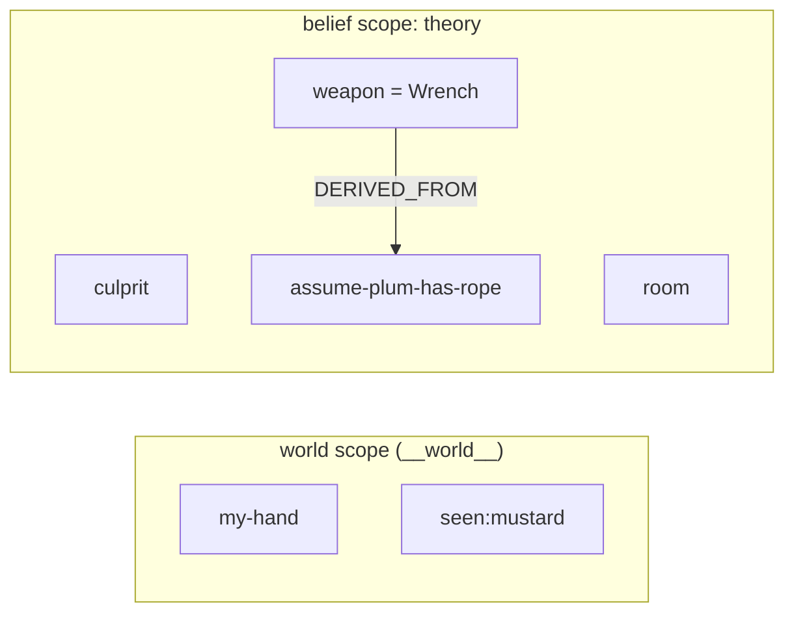

# The Detective's Notebook: Revising a Theory Under Contradiction

You are playing a game of Cluedo. Two very different kinds of knowledge sit in front of you,
and telling them apart is the whole game.

Some things you **know for certain**. The three cards in your own hand. A card an opponent was
forced to show you across the table. You can never be wrong about these, and no later evidence
can take them back: *you cannot un-see a card.*

Everything else is a **working theory** of the crime, held together by inference and constantly
overturned. You guess Colonel Mustard did it in the Kitchen with the Candlestick. Then someone
shows you the Mustard card and your suspect evaporates. You assume Professor Plum is holding the
Rope, reason your way to a weapon on the strength of it, and then that assumption dies too,
dragging the conclusion built on it down with it.

That split, **certain facts versus a provisional theory**, is exactly what doxastica is built
to hold. This tutorial builds a detective's notebook on top of it. Certain facts go in the
reserved **world scope**, where contraction is forbidden. The theory goes in an ordinary
[scope](../explanation/scopes-and-world-scope.md) named `"theory"`, where beliefs are
superseded, retracted, and cascaded as the game turns against them.

By the end you will have:

- Separated **certain** facts (world scope) from a **provisional** theory (a belief scope), and
  seen why the split is the heart of the model.
- [Superseded](../reference/doxastica/core.md#doxastica.core.MemoryCore.revise) a refuted belief and read the crossed-out notebook back with [`get_revision_chain`](../reference/doxastica/core.md#doxastica.core.MemoryCore.get_revision_chain).
- Recorded a defeasible inference with a [`DERIVED_FROM`](../reference/doxastica/models.md#doxastica.models.EdgeType) edge, retracted its basis, and used [`get_impact`](../reference/doxastica/core.md#doxastica.core.MemoryCore.get_impact) to find the conclusion left dangling.
- Hit the [`WorldScopeContractionError`](../reference/doxastica/errors.md#doxastica.errors.WorldScopeContractionError) guard that makes certainty un-retractable.
- Watched a `"theory"` belief harden along a within-scope **stance** gradient (`suspected → believed → certain`) and gated one decision on it — while keeping stance distinct from the certain/provisional scope split.
- Reconstructed the theory as it stood at accusation time with [`get_scope_at`](../reference/doxastica/core.md#doxastica.core.MemoryCore.get_scope_at).

**Time:** about 20 minutes.

**Prerequisites:** Python 3.14 and the zero-dependency in-memory backend. Nothing to install
beyond `pip install doxastica`. It helps to have met the core operations first in
[Your First Belief Store](first-belief-store.md).

!!! info "doxastica knows nothing about Cluedo"
    There is no "card", "suspect", or "accusation" concept inside the library. You *map* those
    onto its primitives. In particular, **you** are the reasoner: doxastica never notices that a
    shown card contradicts your theory, and never decides an inference is dead. It records what
    you tell it, supersedes cleanly, traces what a change touches, and reconstructs history. The
    judgment is always yours. The honest limits are spelled out in [What doxastica does not do](#what-doxastica-does-not-do).

## The mapping

| Cluedo concept | doxastica primitive | Why |
|---|---|---|
| Your own hand, and a card you were shown | a belief in the **world scope** (`WORLD_SCOPE_ID`) | Certain, never retracted: you cannot un-see a card. |
| The current theory (culprit, weapon, room) | a belief in the scope `"theory"` | Provisional: superseded as evidence lands. |
| How firmly you hold a theory belief | its **stance** (`suspected` / `believed` / `certain`) | A within-scope epistemic degree; *you* decide what each rung licenses. |
| A defeasible inference ("assume Plum has the Rope") | a belief in `"theory"` plus a [`DERIVED_FROM`](../reference/doxastica/models.md#doxastica.models.EdgeType) edge to what it rests on | Can be proven false, then contracted, cascading to its dependents. |
| A conclusion drawn *from* that inference | a belief in `"theory"`, `DERIVED_FROM` the inference | Goes stale when its basis is retracted. |
| "What I believed when I accused" | [`get_scope_at(theory, as_of=…)`](../reference/doxastica/core.md#doxastica.core.MemoryCore.get_scope_at) | Reconstruct the theory at a past event. |
| What you infer an opponent has seen | a second belief scope `"opp:Scarlett"` | The multi-scope extension, subordinate to the revision story. |

## Step 1: Build the core

[`MemoryCore`](../reference/doxastica/core.md#doxastica.core.MemoryCore) takes a backend you
inject. We use the zero-dependency [`InMemoryBackend`](../reference/doxastica/backends/memory.md#doxastica.backends.memory.InMemoryBackend).

```python
from uuid import uuid7

from doxastica import (
    BeliefFilter,
    EdgeType,
    InMemoryBackend,
    MemoryCore,
    Stance,
    WORLD_SCOPE_ID,
    WorldScopeContractionError,
)

core = MemoryCore(InMemoryBackend())
```

Every write takes a `source_event_id`: a caller-supplied UUID7 the core treats as an opaque,
time-ordered handle. Mint one with the stdlib `uuid7()`.

## Step 2: Write down what you *know*

The certain facts go in the world scope, identified by
[`WORLD_SCOPE_ID`](../reference/doxastica/models.md#doxastica.models) (the literal
`"__world__"`). These are ground truth: the cards in your hand, and a suspect card an opponent
was forced to reveal.

```python
# The three cards in your own hand — certain, and never revised away.
core.revise(WORLD_SCOPE_ID, "my-hand", ["Green", "Knife", "Study"], source_event_id=uuid7())

# A card an opponent showed you: Colonel Mustard is not the culprit.
core.revise(WORLD_SCOPE_ID, "seen:mustard", "Colonel Mustard", source_event_id=uuid7())
```

Nothing here will ever be superseded or retracted. That is the promise of the world scope, and
Step 8 shows what happens if you try to break it.

## Step 3: Form a first theory

Your working theory of the crime lives in an ordinary scope named `"theory"`. Right now it is a
guess, not a fact. Capture the event id of this first theory: it is the moment you would have
accused, and Step 9 rewinds to it.

```python
accusation_event = uuid7()
core.revise("theory", "culprit", "Mustard", source_event_id=accusation_event)
core.revise("theory", "weapon", "Candlestick", source_event_id=accusation_event)
core.revise("theory", "room", "Kitchen", source_event_id=accusation_event)
```

These are beliefs, not knowledge. Every one of them is about to be tested.

## Step 4: A defeasible inference, with provenance

Real deduction in Cluedo is chained: you *assume* something, then draw a conclusion that rests
on the assumption. Record the assumption as its own belief, capture the returned
[`BeliefState`](../reference/doxastica/models.md#doxastica.models.BeliefState), then draw the
conclusion and link the two with a [`DERIVED_FROM`](../reference/doxastica/models.md#doxastica.models.EdgeType)
edge. The edge convention is **dependent to basis**: `add_edge(conclusion, basis, DERIVED_FROM)`
reads as "conclusion was derived from basis."

```python
# Assume Plum is holding the Rope. This is a guess we may have to abandon.
assume = core.revise(
    "theory", "assume-plum-has-rope", "Plum holds the Rope", source_event_id=uuid7()
)

# On the strength of that assumption, we now believe the weapon is the Wrench.
weapon_state = core.revise("theory", "weapon", "Wrench", source_event_id=uuid7())

# Record *why* we believe it: the weapon conclusion rests on the assumption.
core.add_edge(weapon_state.state_id, assume.state_id, EdgeType.DERIVED_FROM)
```

The notebook now looks like this. The arrow points from the conclusion to the belief it depends
on; the world-scope facts sit apart, certain and unlinked:



## Step 5: Contradiction #1 — the theory is overturned

An opponent shows you the Mustard card. *You* recognise that it refutes `culprit="Mustard"` and
record the correction by revising the belief. The prior value is superseded, not deleted. Plum is
only your new *prime suspect*, though, so you record it at a tentative `stance` — how firmly you
hold the belief, which Step 6 develops.

```python
core.revise("theory", "culprit", "Plum", source_event_id=uuid7(), stance=Stance.suspected)

print([s.value for s in core.get_revision_chain("culprit")])
```

[`get_revision_chain`](../reference/doxastica/core.md#doxastica.core.MemoryCore.get_revision_chain)
returns every state ever recorded for the belief, oldest first: the crossed-out notebook, with
nothing erased.

```text
['Mustard', 'Plum']
```

The `"Mustard"` guess is still on the chain, marked as history. `get_revision_chain` is
cross-scope by `belief_id`, so we keep `culprit` unique across scopes in this notebook.

## Step 6: How sure are you? A within-scope stance gradient

Naming Plum is not the same as being sure it is Plum. Every belief in the `"theory"` scope also
carries a **stance**: *how firmly* you hold it, on a fixed four-rung ladder
`doubted < suspected < believed < certain`. You just superseded Mustard, so Plum entered as a
mere `suspected` guess (that is why Step 5 passed `stance=Stance.suspected`). As cards fall your
way you revise the *same value* at a higher stance — the notebook records rising confidence
without changing who you would accuse.

```python
# A second card is consistent with Plum: upgrade the suspicion to a working belief.
core.revise("theory", "culprit", "Plum", source_event_id=uuid7(), stance=Stance.believed)

# A forced reveal clinches it: now you hold Plum as certain.
core.revise("theory", "culprit", "Plum", source_event_id=uuid7(), stance=Stance.certain)
```

The value never moved — only the stance climbed `suspected → believed → certain`. Reading the
belief back hands you the current stance, and **you** decide what a given rung licenses. Here the
policy is "do not accuse on a mere suspicion":

```python
[culprit] = core.query_scope("theory", BeliefFilter(belief_ids={"culprit"}))
if culprit.stance >= Stance.believed:
    print(f"Accuse {culprit.value}.")
else:
    print("Keep gathering evidence.")
```

```text
Accuse Plum.
```

That `>=` is *your* policy, not the library's. doxastica stores and returns the stance and never
interprets it: it has no notion that `believed` is "enough to accuse". The ordering exists so a
reader can compare rungs; the decision is always yours.

!!! warning "A certain *stance* is not the certain *scope*"
    Two different "certainties" meet here, and conflating them is the easy mistake. **Stance** is
    a *within-scope* epistemic degree — `doubted < suspected < believed < certain` — attached to a
    single belief inside one scope; it says how firmly you hold *that* belief. The **scope** split
    is a *cross-scope* distinction: the reserved world scope holds facts you can never retract,
    while the `"theory"` scope holds a provisional theory. A `"theory"` belief held at
    `Stance.certain` is still a *provisional* belief in a revisable scope — it is not promoted into
    the world scope, and it can still be superseded. "Certain stance" answers *how firmly*;
    "certain versus provisional scope" answers *which partition*. Keep them apart.

## Step 7: Contradiction #2 — a false inference and its fallout

Now new evidence disproves the assumption itself: Plum does *not* hold the Rope. You retract the
assumption with [`contract`](../reference/doxastica/core.md#doxastica.core.MemoryCore.contract).
That leaves the weapon conclusion you built on it dangling, and
[`get_impact`](../reference/doxastica/core.md#doxastica.core.MemoryCore.get_impact) finds it.

```python
core.contract("theory", "assume-plum-has-rope", source_event_id=uuid7())

impact = core.get_impact(assume.state_id)
print(sorted((s.belief_id, s.value) for s in impact.reached))
```

Called on the assumption's state, `get_impact` walks *against* the `DERIVED_FROM` arrows to find
everything that rested on it. The weapon conclusion is now stale, the cue to re-derive it:

```text
[('weapon', 'Wrench')]
```

Nothing was deleted by the contraction; a `retracted` state was appended. Pass
`include_retracted=True` to `query_scope` to see the retracted tail directly:

```python
tail = core.query_scope(
    "theory", BeliefFilter(belief_ids={"assume-plum-has-rope"}), include_retracted=True
)
print([(b.belief_id, b.status.value) for b in tail])
```

```text
[('assume-plum-has-rope', 'retracted')]
```

!!! tip "get_impact reports structure, not judgment"
    `get_impact` tells you the weapon belief was *built on* an assumption that just died. Whether
    the Wrench is actually wrong now is your call as the detective; doxastica only surfaces the
    dependency so you know where to look.

## Step 8: You can't un-see a card

The whole reason the world scope is privileged is that its facts are not revisable. Try to
retract the card you were shown and doxastica refuses:

```python
try:
    core.contract(WORLD_SCOPE_ID, "seen:mustard", source_event_id=uuid7())
except WorldScopeContractionError:
    print("You cannot un-see a card.")
```

```text
You cannot un-see a card.
```

The guard fires before any write, so a forbidden contraction can never leak a partial change.
A world-scope fact that genuinely changes is *superseded* with a new `revise`, never punched out.
The reasoning is in [Scopes and the World Scope](../explanation/scopes-and-world-scope.md#why-world-scope-contraction-is-forbidden).

## Step 9: The audit trail

Because nothing is ever overwritten, you can reconstruct the theory exactly as it stood at any
past event. Rewind to the accusation moment you captured in Step 3 with
[`get_scope_at`](../reference/doxastica/core.md#doxastica.core.MemoryCore.get_scope_at):

```python
at_accusation = {
    b.belief_id: b.value for b in core.get_scope_at("theory", as_of_event_id=accusation_event)
}
print(at_accusation["culprit"])
```

The cut is inclusive and *rewinds* superseded beliefs, so `culprit` resurfaces at the value it
held then, before the Mustard card landed:

```text
Mustard
```

This answers "who was I about to accuse, and on what theory?" without keeping a single manual
snapshot.

## Step 10: Theory of mind is just another scope

Modeling what an *opponent* has seen needs no new machinery: it is one more belief scope. Record
what you have deduced Miss Scarlett must be holding, kept separate from your own theory.

```python
core.revise("opp:Scarlett", "has-seen", "Green", source_event_id=uuid7())
print({b.belief_id: b.value for b in core.query_scope("opp:Scarlett", BeliefFilter())})
```

```text
{'has-seen': 'Green'}
```

This is the multi-scope extension earning its place: the single-agent [Kumiho architecture](../explanation/kumiho-architecture.md)
holds one belief base and cannot express "whose belief?" Each scope is an isolated belief-holder,
with no overlay between them.

## What doxastica does not do

Keeping the model honest matters more than making it sound clever. doxastica is the memory, not
the reasoner:

- **It does not deduce.** It never works out that the Mustard card eliminates a suspect, or that
  an assumption implies a weapon. *You* draw every inference and record the result.
- **It does not solve constraints.** There is no Cluedo solver inside: no elimination grid, no
  search for the one consistent solution.
- **It does not check that values are mutually consistent.** doxastica stores ground beliefs and
  does not run a value-level consistency engine. It will happily hold `culprit="Mustard"` next to
  the card that refutes it until *you* revise. `revise` and `expand` are mechanically identical at
  the core for exactly this reason.
- **It does not infer dependencies.** You record a `DERIVED_FROM` edge when one belief rests on
  another; doxastica does not discover the link for you.

What it *does* give you is an append-only, revisable, traceable notebook: beliefs that supersede
cleanly, a contraction cascade that shows what a retraction touches, and a full history you can
rewind. That is precisely the part a plain state store with timestamps cannot replicate: a held
belief, contradicted and superseded, with its dependents made stale.

## Step 11: Verification

Run the whole investigation as one script and assert the outcomes. This is the complete,
self-contained program:

```python
from uuid import uuid7

from doxastica import (
    BeliefFilter,
    EdgeType,
    InMemoryBackend,
    MemoryCore,
    Stance,
    WORLD_SCOPE_ID,
    WorldScopeContractionError,
)

core = MemoryCore(InMemoryBackend())

# What you KNOW — certain facts in the world scope.
core.revise(WORLD_SCOPE_ID, "my-hand", ["Green", "Knife", "Study"], source_event_id=uuid7())
core.revise(WORLD_SCOPE_ID, "seen:mustard", "Colonel Mustard", source_event_id=uuid7())

# Your first theory — provisional, in the "theory" scope. Capture the accusation moment.
accusation_event = uuid7()
core.revise("theory", "culprit", "Mustard", source_event_id=accusation_event)
core.revise("theory", "weapon", "Candlestick", source_event_id=accusation_event)
core.revise("theory", "room", "Kitchen", source_event_id=accusation_event)

# A defeasible inference, recorded with provenance: the weapon rests on the assumption.
assume = core.revise(
    "theory", "assume-plum-has-rope", "Plum holds the Rope", source_event_id=uuid7()
)
weapon_state = core.revise("theory", "weapon", "Wrench", source_event_id=uuid7())
core.add_edge(weapon_state.state_id, assume.state_id, EdgeType.DERIVED_FROM)

# Contradiction #1 — the Mustard card refutes culprit="Mustard"; Plum enters as a suspicion.
core.revise("theory", "culprit", "Plum", source_event_id=uuid7(), stance=Stance.suspected)
assert [s.value for s in core.get_revision_chain("culprit")] == ["Mustard", "Plum"]

# Evidence hardens the same value up the stance ladder: suspected -> believed -> certain.
core.revise("theory", "culprit", "Plum", source_event_id=uuid7(), stance=Stance.believed)
core.revise("theory", "culprit", "Plum", source_event_id=uuid7(), stance=Stance.certain)
[culprit] = core.query_scope("theory", BeliefFilter(belief_ids={"culprit"}))
assert culprit.stance is Stance.certain  # reader-side policy would now accuse

# Contradiction #2 — the assumption dies; its conclusion is now stale.
core.contract("theory", "assume-plum-has-rope", source_event_id=uuid7())
stale = {(s.scope_id, s.belief_id, s.value) for s in core.get_impact(assume.state_id).reached}
assert ("theory", "weapon", "Wrench") in stale

# You can't un-see a card: contracting the world scope is forbidden.
try:
    core.contract(WORLD_SCOPE_ID, "seen:mustard", source_event_id=uuid7())
    raise AssertionError("world-scope contraction should have raised")
except WorldScopeContractionError:
    pass

# The audit trail: the theory rewinds to who you were about to accuse.
at_accusation = {
    b.belief_id: b.value for b in core.get_scope_at("theory", as_of_event_id=accusation_event)
}
assert at_accusation["culprit"] == "Mustard"

print("All checks passed.")
```

Every assertion passing confirms the arc: a refuted belief superseded, a conclusion made stale by
the retraction of its basis, certainty protected from contraction, and the theory reconstructable
at accusation time.

## What you have learned

- **Certain facts and a provisional theory are different partitions.** Ground truth lives in the
  world scope, where contraction is forbidden; the working theory lives in an ordinary scope,
  where beliefs are superseded and retracted.
- **Revision supersedes, it never overwrites.** `get_revision_chain` reads the crossed-out
  notebook back, oldest first, with nothing destroyed.
- **Edges make cascades answerable.** A `DERIVED_FROM` edge from a conclusion to its basis is what
  lets `get_impact` find the belief left dangling when the basis is retracted.
- **Stance is a within-scope degree, not a scope.** A `"theory"` belief hardens
  `suspected → believed → certain` while staying provisional; *you* compare rungs to drive a
  decision, and a `certain` stance never promotes a belief into the world scope.
- **History is a free audit log.** `get_scope_at` rewinds the theory to any past event without a
  single manual snapshot.

## Further reading

- [The Superseded Chain: Append-Only, No Recovery](../explanation/superseded-chain-no-recovery.md): why nothing is ever deleted.
- [Scopes and the World Scope](../explanation/scopes-and-world-scope.md): the scope model and why world-scope contraction is forbidden.
- [What Is AGM Belief Revision?](../explanation/agm-belief-revision.md): the theory behind revise, expand, and contract.
- [How to Retract a Belief with contract](../how-to/contract-a-belief.md): the contraction API, vacuity no-op, and world-scope guard in task form.
- [How to Trace a Dependency Cascade with get_impact](../how-to/trace-dependency-cascade.md): the `add_edge` and `get_impact` API in task form.
</content>
</invoke>
